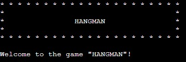
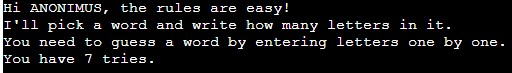
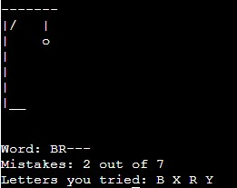
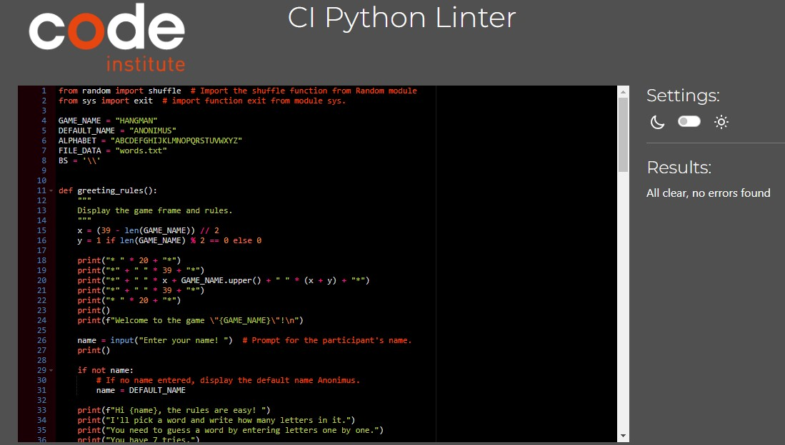

# The Hangman game

Hangman is a popular word-guessing game that plays in the terminal window on Heroku. The game based on the standard rules of hangman where a random word is chosen by computer. The word is hidden by dashes and the player needs to reveal the word by guessing letters one by one. 
The game involves a gallows-shaped drawing and for each incorrect guess, a body part of a stick figure is drawn on the gallows. The player has 7 tries before the game finishes.

The live version of this game is located [here](https://hangman-1-5c8273b47be1.herokuapp.com/). 

## Features
- The game start with the generated banner and greetings.

     

- The game prompts the player to enter their name. If no name is entered, the game assigns the name ANONIMUS to the player.

- After the user entered their name, the game displays player's name and the rules of the game. 

     
   

- The game selects a random word from the txt file. If the list is empty, show the message and exit the game.  

     

- The game dispays empty gallows, current secret word state hidden with dashes, amount of mistakes, and a list of entered letters. 

     

- The game promts the player to guess a letter. 

     

- Input validation and error checking
  - The game accepts only a single latin letter. If unsupported symbol or letter is entered, the game prompts to enter only one latin letter.  
  - With each entered letter, the games checks if it exists in the word. If the letter exists, the dash in the hidden word is replaced with this letter.
  - If a word is not guessed, and mistakes less than 7, gallows adds a part of the stick man body and the mistakes counter incremented.
  - At the end of the game, the player is asked if they want to play again. They need to enter Yes or No. If a wrong value is entered, the message is displayed that they need to enter the correct value.  

## Future features
- Difficulty levels: Allow players to choose between different difficulty levels, such as easy, medium, and hard. Each level can have a different word length or a limited number of incorrect guesses.
- Time challenge: Add a time-based mode where players have a limited amount of time to guess the word correctly. This mode can increase the excitement and challenge players to think quickly.
- Categories or themes: Include a variety of word categories or themes, such as animals, countries, movies, or sports. This adds diversity and makes the game more enjoyable for players with different interests.

## Progam logic  

Diagram

## Testing and Validation

- The code was tested in the termital by inputing different invalid values, such as numbers or non-latin characters. 
- Throughout the build of the project, utilized multiple print statements to visualize variable outputs.
- Validated the code in the PEP8 CI Python Linter with no errors found.

 

 __User Actions__

|  Feature |  Action |  Expected Result | Actual Result |
|---|---|---|---|
|  The game greetings |  Lunching the game | The greetings is displayed  | Works as expected  |
|  The game prompts to enter player's name |  Input a name | The entered name is displayed | Works as expected  |
|  Display rules of the game |  Input a name | Rules of the game are displyed in the terninal| Works as expected  |
|  Generate a secret word |  Input a name | A secret word is generated | Works as expected  |
|  Display the amount of letters in the secret word | Input a name | The amount of lettes in the secret word is shown | Works as expected  | 
|  Display the gallows |  Input a name | The gallows is displayed | Works as expected  |
|  Hide the secred word with dashes |  Input a name | The secred word is hidden | Works as expected  |
|  Mistakes counter |  Player adds a letter | If the letter is not in the word, the counter incremented by 1 | Works as expected  |
| Show tried letters |  Player adds a letter | The game displays added letters | Works as expected  |
| Gallow displays body parts |  Player adds a letter | If the entered letter is not in the word, a body part revealed on the gallows | Works as expected  |
| When a player guessed a word or exausted all tries, prompt to play again |  Player guessed a word or exausted all tries | Ask if they want to play again | Works as expected  |

__Invalid input handeling__ 

|  Feature |  Action |  Expected Result | Actual Result |
|---|---|---|---|
|  The game accept only one latin character |  Adding non-latin or more than 1 character | The message appears asking to enter just 1 letter | Works as expected  |
| Prompt to enter "Yes" or "No" |  Player guessed a word or exausted all tries | Display a message to enter only valid input | Works as expected  |
| Display a message when there are no more words in the file | Player tried all words in the file | Display a message that there are no more words | Works as expected  |

## Deployment
1. Login into heroku.com site.
2. Click on the "New" and then on the "Create a new App".
3. Enter the app name and choose the region and click "Create app".
4. Click on the Settings tab to adjust the settings.
5. Click on the "Config vars" button.
6. Enter the PORT value into the KEY field and 8000 into the VALUE field. Then click on the "Add" button.
7. Click Add Buildpacks, select Python in the pop-up window and click Add Buildpacks.
8. Click Add Buildpacks once again but this time select Node. 
9. The link to the app can be found in the section Domains.
10. Click the Deploy tab.
11. Select the deplyement method GitHub.
12. Search for the repository and click connect.
13. Choose to either deploy using automatic deploys which means heroku will rebuild the app everytime you push your changer, or manual deployement. 
14. Click Deploy branch.

## Technologies Used
 - Python -
 - Heroku 

## Programs Used
- [GitHub:](https://github.com/) Used for version control and to store the projects code after being pushed from GitPod or Codeanywhere.
- [Codeanywhere:](https://codeanywhere.com/) Codeanywhere is a cloud-based integrated development environment that includes a built-in code editor, a fully-featured development environment for servers and containers, an integrated debugger, and live collaboration tools.

## Credits

- The code was inspired by the code from this site: [https://it-start.online](https://it-start.online/articles/pishem-igru-viselica-na-python-2).
 