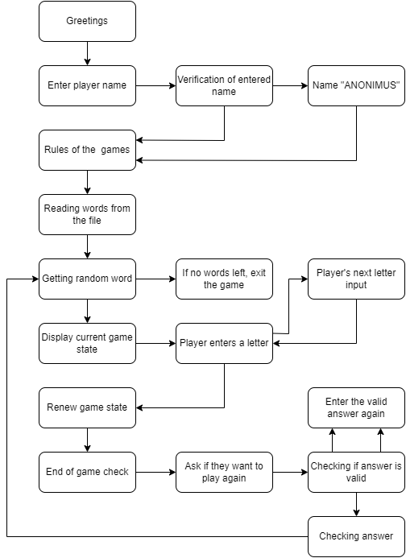

# The Hangman game

Hangman is a popular word-guessing game that plays in the terminal window on Heroku. The game based on the standard rules of hangman where a random word is chosen by computer. The word is hidden by dashes and the player needs to reveal the word by guessing letters one by one. 
The game involves a gallows-shaped drawing and for each incorrect guess, a body part of a stick figure is drawn on the gallows. The player has 7 tries before the game finishes.

The live version of this game is located [here](https://hangman-1-5c8273b47be1.herokuapp.com/). 

## Features
- The game start with the generated banner and greetings.

     

- The game prompts the player to enter their name. If no name is entered, the game assigns the name ANONIMUS to the player.

- After the user entered their name, the game displays player's name and the rules of the game. 

     
   

- The game selects a random word from the txt file. If the list is empty, show the message and exit the game.  

     

- The game dispays empty gallows, current secret word state hidden with dashes, amount of mistakes, and a list of entered letters. 

     

- The game promts the player to guess a letter. 

     

- Input validation and error checking
  - The game accepts only a single latin letter. If unsupported symbol or letter is entered, the game prompts to enter only one latin letter.  
  - With each entered letter, the games checks if it exists in the word. If the letter exists, the dash in the hidden word is replaced with this letter.
  - If a word is not guessed, and mistakes less than 7, gallows adds a part of the stick man body and the mistakes counter incremented.
  - At the end of the game, the player is asked if they want to play again. They need to enter Yes or No. If a wrong value is entered, the message is displayed that they need to enter the correct value.  

## Progam logic diagram   

 

## Testing and Validation

- The code was tested in the termital by inputing different invalid values, such as numbers or non-latin characters. 
- Throughout the build of the project, utilized multiple print statements to visualize variable outputs.
- Validated the code in the PEP8 CI Python Linter with no errors found.

 

 __User Actions__
|  Feature |  Action |  Expected Result | Actual Result |
|---|---|---|---|
|  The game greetings |  Lunching the game | The greetings is displayed  | Works as expected  |
|  The game prompts to enter player's name |  Input a name | The entered name is displayed | Works as expected  |
|  Display rules of the game |  Input a name | Rules of the game are displyed in the terninal| Works as expected  |
|  Generate a secret word |  Input a name | A secret word is generated | Works as expected  |
|  Display the amount of letters in the secret word | Input a name | The amount of lettes in the secret word is shown | Works as expected  | 
|  Display the gallows |  Input a name | The gallows is displayed | Works as expected  |
|  The secred word is hidden with dashes |  Input a name | The secred word is hidden | Works as expected  |
|  Mistakes counter |  Player adds a letter | If the letter is not in the word, the counter incremented by 1 | Works as expected  |
| Show tried letters |  Player adds a letter | The game displays added letters | Works as expected  |
| Gallow displays body parts |  Player adds a letter | If the entered letter is not in the word, a body part revealed on the gallows | Works as expected  |

## Deployment

## Technologies Used
Languages Used

Programs Used

## Credits
 